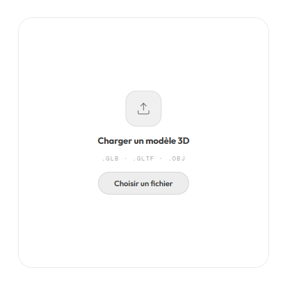
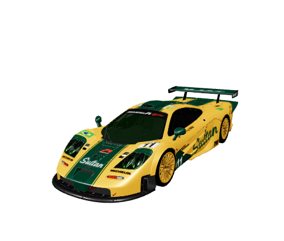
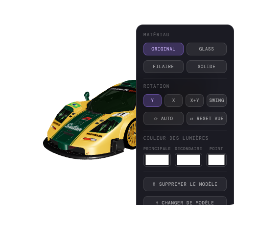

## 🧩 Widget Integration — 3D Viewer

<div align="center">

  
  
  

</div>

---

### 🌐 Overview

This project is designed as a **lightweight and modern 3D widget** that can be embedded directly into web environments.

Unlike traditional 3D viewers, this component is built to be:
- Minimal
- Portable
- Easy to integrate
- Fully client-side

It can run anywhere a browser can render HTML.

---

### 🧠 Concept

The idea behind this project is simple:

> Turn any static page into an interactive 3D experience.

This widget allows users to:
- Upload 3D models
- Interact with them in real-time
- Customize rendering and lighting
- Persist their models locally

All of this without any backend.

---

### 🧩 Use as a Widget

This viewer is not just a standalone app — it is built to function as a **reusable widget**.

You can embed it inside:

- 🦊 Firefox extensions (such as *Renewed Tab*)
- 🌐 Custom browser start pages
- 🧩 Web dashboards
- 🖥️ Personal productivity tools
- 📦 Internal tools or admin panels

---

### 🦊 Browser Extension Compatibility

This widget works perfectly inside browser extensions.

For example, with Firefox and the extension:

👉 *Renewed Tab*

You can replace your default new tab page with a fully interactive 3D environment.

---

### 💡 Example Use Case

Imagine opening a new tab and seeing:

- Your favorite 3D model rotating smoothly
- A clean glass UI
- Custom lighting matching your theme
- Interactive controls on hover

Instead of a static page, you get a **dynamic visual experience**.

---

### ⚙️ Features in Widget Mode

When used as a widget, you still get all features:

- 📂 Drag & Drop model upload
- 🎮 Mouse / touch controls
- 🔄 Auto rotation modes
- 🎨 Material switching (glass, wireframe, solid)
- 💡 Real-time lighting customization
- 💾 Model persistence via IndexedDB
- ⚡ Fast loading and smooth rendering

---

### 🧪 Performance

The widget is optimized for:

- ⚡ Fast load time
- 🧠 Low memory usage
- 📱 Smooth interactions
- 🖥️ Desktop and laptop environments

It runs entirely in the browser using WebGL.

---

### 🔌 Integration

Integrating the widget is extremely simple.

Just include the HTML file:

```html
<iframe src="index.html"></iframe>
